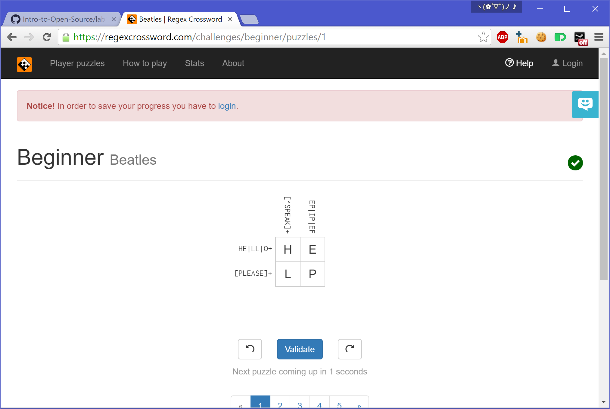

### LAB 1
##c.2
1. Do not answer questions that are too basic, tell them how they can find answer themselves instead.
2. Try to teach rather than giving the direct answer when possible.

##c.3
Jesse was aimed to provide a better searching environment. His approach is storing existing information's index on a server. However he fell in a lawsuit claiming his action is pirate. Jesse refuse to admit he was wrong, and the lawsuit has deeply affected his life. Jesse also claimed that he did not mean to do all these, but was forced to stand at his current situation.

##Screenshots

